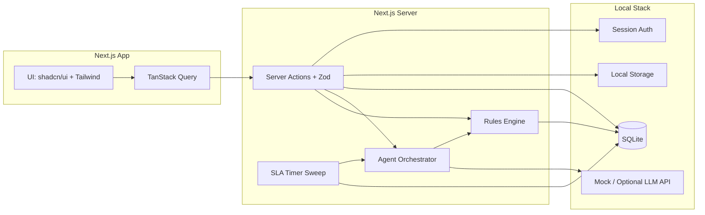
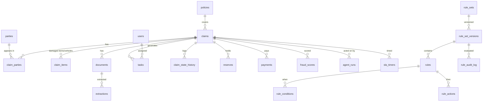

# DESIGN.md — aiinsclaim Architecture & Decision Records

Canonical technical reference. Every Cursor build prompt references sections here as `DESIGN §x.y`.

---

## 1. System Overview

**aiinsclaim** is an AI-native, agentic claims processing system for **Auto** and **Property/Home** lines. Portfolio/learning project on **mock data**, architected production-grade.

Core loop: **FNOL intake → triage → assessment → settlement → closed**, driven by:

- a **claim state machine** (§4) enforcing legal transitions,
- a **rules engine** (§5) evaluating DB-stored, effective-dated decision tables,
- an **agent layer** (§7) proposing decisions with confidence + reason codes,
- **human-in-the-loop task queues** (§4.3) where staff accept/override agent proposals,
- **SLA timers** (§4.4) escalating stalled work,
- an **audit trail** on every state change, rule evaluation, and agent action.

Design stance (from research, 00-RESEARCH §2): agent-native core (Five Sigma pattern), configuration-over-code (Duck Creek pattern), green-lane straight-through processing for low-risk claims (Lemonade/Shift pattern), continuous re-scoring (EvolutionIQ pattern).

## 2. Business Architecture

### 2.1 Personas

| Persona | Role code | Journey highlights |
|---|---|---|
| Claimant / Policyholder | `claimant` | Files FNOL, uploads documents, tracks status |
| Intake Agent (call center) | `intake_agent` | Assisted FNOL on behalf of claimant, completeness checks |
| Claims Adjuster | `adjuster` | Prioritized worklist, assessment workbench, reserve & settlement proposals |
| Senior Adjuster / Supervisor | `supervisor` | Escalations, overrides above authority, queue rebalancing, SLA dashboard |
| SIU / Fraud Analyst | `siu_analyst` | Fraud referral queue, investigation notes, disposition |
| Claims Ops Admin | `admin` | Rules/decision-table configuration, user management, seed/reset |

### 2.2 Capability Map

```
Claims Intake        Claims Triage         Claims Assessment      Settlement & Payment
├─ FNOL wizard       ├─ Severity scoring   ├─ Document extraction ├─ Settlement calc
├─ Policy lookup     ├─ Fraud scoring      ├─ Damage assessment   ├─ Authority check
├─ Completeness      ├─ Routing/assignment ├─ Reserve suggestion  ├─ Payment issuance
└─ Acknowledgement   └─ Green-lane STP     └─ Coverage evaluation └─ Recovery/closure

Cross-cutting: Rules Engine & Decision Tables · Agent Orchestration · HITL Task Queues ·
SLA Timers & Escalation · Audit & Compliance · Dashboards & Reporting · Admin Configuration
```

Business rules govern behavior at every decision point; see Business Rules Catalog (`BUSINESS-RULES.md`) — decision tables `BR-TRIAGE-001`, `BR-FRAUD-001`, `BR-ASSIGN-001`, `BR-RESERVE-001`, `BR-AUTH-001`, `BR-SLA-001`, `BR-ESC-001`, `BR-DOC-001`, `BR-STP-001`.

## 3. Technical Architecture

### 3.1 Stack (confirmed baseline)

| Layer | Choice | Notes |
|---|---|---|
| Frontend | Next.js App Router, TypeScript `strict` | Server Components default; client components only for interactivity |
| UI | Tailwind CSS (+ shadcn/ui when added) | Design tokens in §9 |
| Data fetching | TanStack Query (client) + server actions | Query for live queues/dashboards; actions for mutations |
| Validation | Zod everywhere (API edge + forms + agent tool I/O) | Schemas in `src/lib/schemas`, shared client/server |
| Database | SQLite + Drizzle ORM | File at `ljadev/data/aiinsclaim.db`; schema in `src/lib/db/schema/` |
| Auth | iron-session + bcrypt | Demo accounts via `npm run seed`; scope checks in `src/lib/auth/` |
| Storage | Local filesystem | `ljadev/storage/claim-documents/` |
| Agents | Mock agents + optional OpenAI-compatible API | §7; no cloud gateway required for learning |
| Testing | Vitest (unit), Playwright (e2e), rules-engine golden tests | TEST-PLAN.md |

### 3.2 Component Diagram



### 3.3 Request Flow (example: document uploaded)

1. Client uploads to local storage via server action (`uploadClaimDocument`, Zod-validated).
2. Server action records `documents` row (`status='uploaded'`), enqueues extraction.
3. `AGT-EXTRACT` (mock or optional LLM API) produces structured fields + confidence per field.
4. Confidence ≥ threshold (parameter `doc.autoaccept_confidence`, not hard-coded) → fields applied, else HITL task `verify_extraction` created.
5. Claim re-scored (`AGT-TRIAGE` + `BR-FRAUD-001`); state machine may transition; audit rows written for every step.

## 4. Claim Lifecycle State Machine

### 4.1 States

`draft → submitted → in_triage → in_assessment → pending_info → in_settlement → approved → paid → closed`
Terminal/exception: `denied`, `withdrawn`, `referred_siu` (parallel flag, not a state — see 4.2).

### 4.2 Transition Table (enforced in `claim_transitions` — DB-driven, not hard-coded)

| From | To | Trigger | Guard |
|---|---|---|---|
| draft | submitted | claimant/intake submits | FNOL completeness per BR-DOC-001 |
| submitted | in_triage | auto on submit | — |
| in_triage | in_assessment | triage decision | BR-TRIAGE-001 result routed |
| in_triage | approved | green-lane STP | BR-STP-001 all-pass + fraud score low |
| in_assessment | pending_info | adjuster requests info | open info request exists |
| pending_info | in_assessment | info received | document/status update |
| in_assessment | in_settlement | assessment complete | coverage confirmed, reserve set |
| in_settlement | approved | settlement approved | within authority per BR-AUTH-001, else supervisor task |
| approved | paid | payment issued (mock) | payment record created |
| paid | closed | closure checklist done | no open tasks |
| any non-terminal | denied | denial decision | denial reason coded; supervisor approval |
| draft/submitted | withdrawn | claimant withdraws | — |

Fraud referral: `claims.siu_referred = true` + SIU task; claim continues or holds per `BR-FRAUD-001` action. Every transition writes `claim_state_history` (who/when/why/triggering rule or agent).

### 4.3 Human-in-the-Loop Task Queues

`tasks` table: `type` (verify_extraction, review_triage, review_fraud, assess_claim, approve_settlement, escalation, siu_review, request_info), `queue` (intake, adjusting, supervision, siu), `priority`, `sla_due_at`, `claim_id`, `payload` (agent proposal JSON), `status` (open, in_progress, done, cancelled), `resolution` (accepted, overridden, rejected) + `resolution_reason` (mandatory on override). Worklist ordering: priority desc, sla_due_at asc — EvolutionIQ-style "what needs you now", with reason codes from the originating rule/agent.

### 4.4 SLA Timers & Escalation

- `sla_timers` rows created by rules (`BR-SLA-001`) on state entry / task creation; paused in `pending_info` if rule says so.
- A sweep (Next.js route handler invoked by scheduler/cron; in dev, manual trigger button) marks breaches and applies `BR-ESC-001` (notify → reassign → escalate to supervisor).
- All parameterized: durations live in `parameters` table (`sla.triage_hours`, `sla.assessment_days.auto`, …).

## 5. Rules Engine & Decision Tables

### 5.1 Model

- `rule_sets` — logical group (e.g. `BR-TRIAGE-001`), with `hit_policy` (`first`, `all`, `collect_sum`).
- `rule_set_versions` — immutable versions with `effective_from`/`effective_to`, `status` (draft, active, retired), `created_by`.
- `rules` — ordered rows within a version.
- `rule_conditions` — (rule_id, input_key, operator [`eq,neq,gt,gte,lt,lte,in,between,contains,is_null`], value_json).
- `rule_actions` — (rule_id, action_type [`set_output,route,create_task,set_flag,add_score,require_approval`], params_json).
- `rule_audit_log` — every evaluation: inputs, matched rules, outputs, rule_set_version_id, actor (`system|agent:<id>|user:<id>`), timestamp.
- `parameters` — key/value/type/effective-dated programmable setup values (thresholds, durations, limits). **No business number is ever hard-coded.**

### 5.2 Evaluation

Pure TypeScript function `evaluateRuleSet(code, inputs, asOf)`: loads active version as-of date, evaluates conditions against a Zod-validated input object, applies hit policy, returns `{outputs, matchedRules, versionId}` and writes `rule_audit_log`. Deterministic and unit-testable with golden tables (TEST-PLAN §rules).

### 5.3 Admin UI

Rule sets list → version detail (grid of condition/action columns, Duck Creek-style) → edit as **new draft version** → simulate against sample inputs → activate (effective-dated). Activation requires `admin` role; every change audited. Retired versions remain queryable for historical decisions.

## 6. Data Model (ERD summary — full column detail in DATA-DICTIONARY.md)



Key tables: `users` (role, authority_level), `policies`, `parties`, `claims` (line_of_business, status, severity, complexity, siu_referred, incident fields), `claim_items`, `documents`, `extractions` (fields_json, confidence, verified_by), `tasks`, `sla_timers`, `reserves`, `payments`, `fraud_scores` (score, band, reason_codes), `agent_runs` (agent_id, input/output json, confidence, accepted/overridden), rules tables (§5.1), `parameters`, `audit_log` (generic), `notifications`.

**Access control:** claimants see only their own claims/documents (app-layer scope); staff scoped by role; admin-only on rules tables; `rule_audit_log`/`claim_state_history` append-only (no UPDATE/DELETE in helpers).

## 7. Agentic Layer

Principles: every agent is a **proposer, not a decider** unless a decision table explicitly grants auto-action (green lane); every run recorded in `agent_runs` with inputs, outputs, confidence, model, prompt version; every output carries reason codes; humans can override anything, overrides feed dashboards. Full contracts in AGENT-OPS.md.

| ID | Agent | Purpose | Key tools | Auto-act? |
|---|---|---|---|---|
| AGT-INTAKE | Intake Copilot | Guide FNOL, check completeness, draft incident narrative summary | policy lookup, BR-DOC-001 eval | No — assists form |
| AGT-EXTRACT | Document Extractor | OCR+LLM structured extraction from uploaded docs | AI Gateway (vision+LLM), doc schemas | Auto-apply above confidence param, else HITL |
| AGT-TRIAGE | Triage Analyst | Severity/complexity scoring; feeds BR-TRIAGE-001 routing | claim reader, rules engine | Routing yes (rule-governed); STP only via BR-STP-001 |
| AGT-FRAUD | Fraud Signal Agent | Narrative-anomaly + consistency signals feeding BR-FRAUD-001 | claim reader, doc extractions | Never — flags only |
| AGT-SUMMARY | Claim Summarizer | Maintain rolling claim summary + timeline on material change | claim reader | Yes (content only, no decisions) |
| AGT-RESERVE | Reserve Suggester | Suggest initial/updated reserve using BR-RESERVE-001 + comparables | rules engine, claim items | No — adjuster confirms |
| AGT-COMMS | Comms Drafter (Later) | Draft claimant emails/letters | claim summary, templates | No — human sends |
| AGT-COPILOT | Claims Copilot (Later) | NL querying over claims data | read-only SQL tool (allowlisted views) | Read-only |

Failure modes & guardrails (summary): schema-invalid agent output → retry once → HITL task; low confidence → HITL; AI Gateway timeout → task falls back to manual queue, never blocks state machine; prompt-injection defense: document text is data, never instructions (delimited, and extraction output strictly Zod-parsed); no PII in logs (log IDs, not names).

## 8. Alternatives Analysis (ADR summaries)

| # | Decision | Recommended | Credible alternative | Deciding trade-off |
|---|---|---|---|---|
| ADR-01 | Backend platform | SQLite + Drizzle + local auth/storage (learning) | InsForge/Postgres (production path) | Zero infra for learning; same domain model and query patterns; upgrade path to Postgres/Turso when deploying |
| ADR-02 | Rules engine | Custom TS evaluator over DB decision tables | Embed a BRMS (e.g. GoRules/ZEN) | Custom = fully inspectable, teachable, no runtime dep; BRMS = more power we don't need for a portfolio scope |
| ADR-03 | State machine | DB-driven transition table + TS guard functions | XState | DB-driven keeps transitions configurable/auditable like rules; XState is elegant but hard-codes business flow in code |
| ADR-04 | Agent orchestration | Thin in-process orchestrator in server actions | External workflow engine (Temporal/Inngest) | In-process is agent-buildable and debuggable; Temporal is the production answer but heavy for mock-data scope — noted as production path |
| ADR-05 | Fraud scoring | Decision table + LLM signal inputs | Trained ML model | No real data to train on; decision table is explainable and admin-editable (Shift-style reason codes preserved) |
| ADR-06 | Doc extraction | Mock extraction + optional OpenAI-compatible API | Dedicated OCR (Textract/Tesseract) + LLM | Mock-first for learning; real LLM optional via env vars |
| ADR-07 | Client data | TanStack Query for queues/dashboards | Server Components only | Queues need polling/invalidation; RSC-only would force full refreshes |
| ADR-08 | SLA sweeps | Scheduled route handler + manual dev trigger | pg_cron / queue worker | Simplest agent-buildable option; pg_cron is the production note |

## 9. Design System — "Ledger" (insurance ops aesthetic)

- **Typography:** Inter (UI), JetBrains Mono (IDs, amounts, timestamps). Dense but generous line-height in forms.
- **Color tokens (CSS vars, light + dark):** `--bg`, `--surface`, `--surface-raised`, `--border`, `--text`, `--text-muted`, `--primary` (deep indigo #3B4CCA-family), `--accent` (teal), semantic: `--success`, `--warning`, `--danger`, `--info`; **status ramp** for claim states (draft slate → triage amber → assessment blue → settlement violet → paid/closed green → denied red); **fraud bands** low/medium/high/critical (green→red).
- **Density:** compact tables for worklists (32px rows), comfortable forms. Dark mode first-class (ops teams live in it).
- **Signature components:** ClaimStatusTimeline (horizontal stepper), TaskCard (priority + SLA countdown chip), AgentProposalCard (confidence bar, reason codes, Accept/Override buttons), DecisionTableGrid (admin), FraudBandBadge, SlaCountdown (turns amber at 75%, red on breach).
- **Accessibility:** WCAG 2.1 AA standing AC — contrast ≥4.5:1, full keyboard nav on queues and decision-table grid, aria-live for SLA/status changes, never color-only status (icon + label).

## 10. Security & Quality Bar

- Zod validation at every server action and agent tool boundary; reject-by-default.
- Session auth: roles (`claimant, intake_agent, adjuster, supervisor, siu_analyst, admin`) enforced via `requireRole()` + scope helpers (§6).
- Secrets only in env; never in repo or client bundle.
- No PII in logs or agent traces: reference `claim_id`/`party_id`, never names/addresses/emails; `agent_runs.input_json` stores redacted snapshots.
- Append-only audit tables; admin actions double-logged (`audit_log` + domain audit table).
- Accessibility per §9; every PBI carries an a11y AC.

## 11. Repository Layout

```
/ljadoc                    ← architecture & requirements docs
/ljadev                    ← SQLite DB, local storage, dev setup (see ljadev/README.md)
/src/app                   ← App Router routes (route groups: (claimant), (staff), (admin))
/src/app/api               ← route handlers (SLA sweep, webhooks)
/src/components            ← UI + signature components
/src/lib/schemas           ← Zod schemas (single source of truth, see API-CONTRACTS.md)
/src/lib/rules             ← rules engine evaluator + types
/src/lib/state-machine     ← transition guard functions
/src/lib/agents            ← agent definitions, prompts, orchestrator
/src/lib/db                ← Drizzle client, schema, query helpers
/src/lib/auth              ← session auth + access scope helpers
/src/lib/storage           ← local document storage
/seed                      ← seed scripts + generators (DATA-DICTIONARY §seed)
/tests                     ← vitest unit + rules golden tests; /tests/e2e Playwright
```
